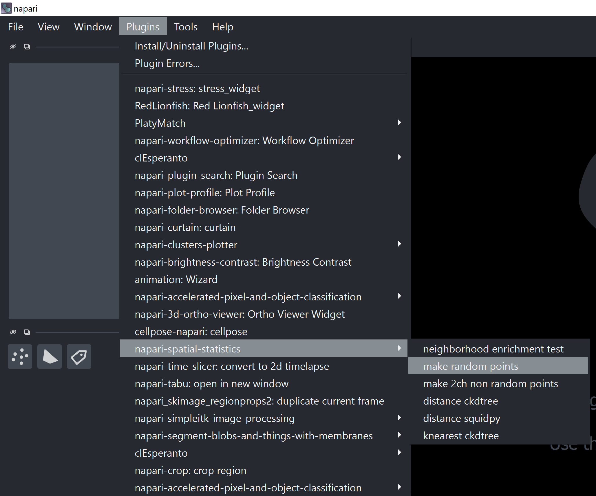
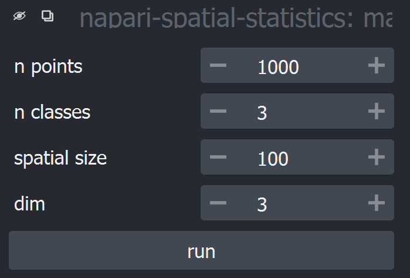
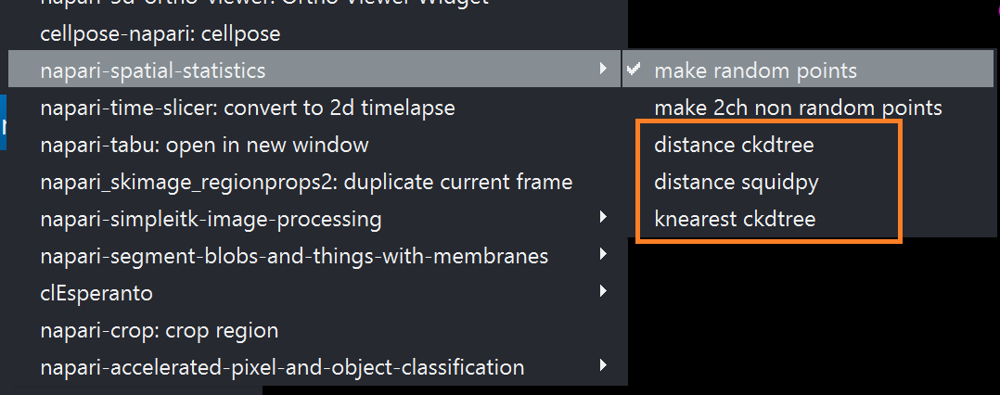
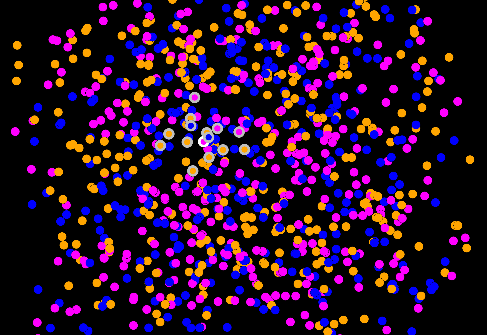
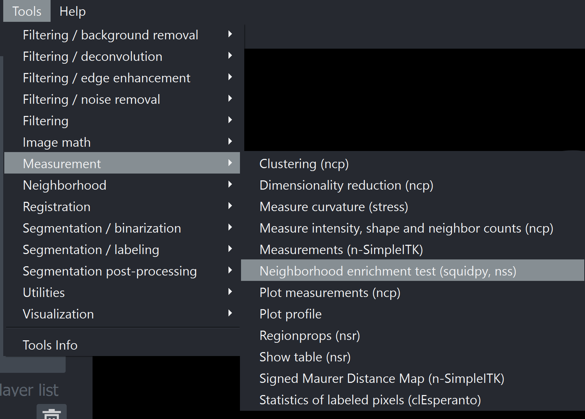
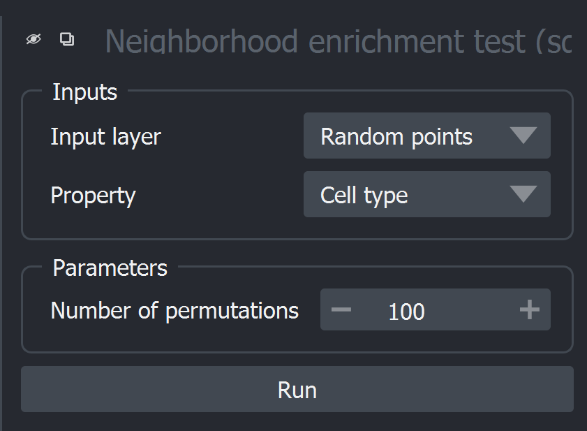
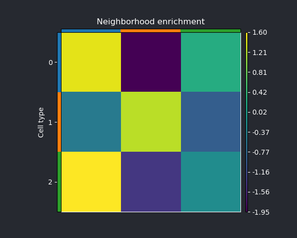
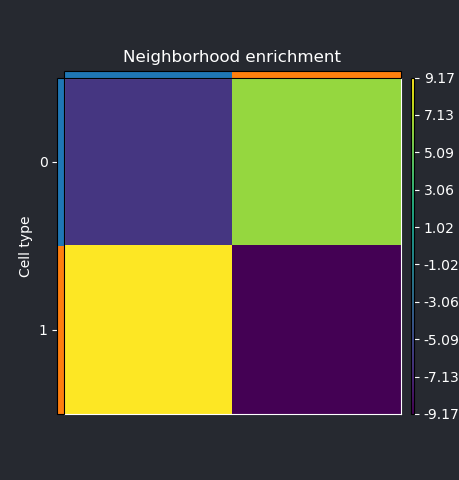

# napari-spatial-statistics

[](https://github.com/jo-mueller/napari-spatial-statistics/raw/main/LICENSE)
[](https://pypi.org/project/napari-spatial-statistics)
[](https://python.org)
[](https://github.com/jo-mueller/napari-spatial-statistics/actions)
[](https://codecov.io/gh/jo-mueller/napari-spatial-statistics)
[](https://napari-hub.org/plugins/napari-spatial-statistics)

Analyze architecture of spatially distributed objects.

This plugins aims to make methods for spatial statistics available in Napari. Common usecases for spatial statistics are described in [this paper](https://www.frontiersin.org/articles/10.3389/fphys.2022.832417/full). In brief, methods of spatial statistics allow to answer questions like the following:
- Single type of objects in space: Do the objects appear clustered together or are they randomly scattered throughout space?
- Two or multiple types of objects: Does object of typa A appear within the neighborhood of tybe B objects more often than what we would expect from randomly distributed objects?

----------------------------------

## Usage

Napari-spatial-statistics currently allows analyzing spatial distributions of point layers in Napari. This tutorial describes a typical workflow:

### Data generation
 

The settings of the data generator refer to the following properties:
- `n_points`: Number of points to be created
- `n_classes`: Number of point classes: Each "class" could, for instance, refer to a different cell type in a real experiment.
- `spatial_size`: The points will be distributed in a `[SxSxS]`-sized space. `S` can be set using this input.
- `dim`: Select whether data should be 2D/3D/4D.

The result (in 3D) will look like this:


### Neighborhood definition:
Napari-spatial-statistics provides a few basic algorithms to determine neighborhoods between points in space (e.g., k-nearest neighbors and distance-based neighborhood):



Currently implemented algorithms include:
* [distance-based neighborhood (scipy)](https://docs.scipy.org/doc/scipy/reference/generated/scipy.spatial.cKDTree.query_ball_point.html#scipy.spatial.cKDTree.query_ball_point)
* [distance-based neighborhood (squidpy)](https://squidpy.readthedocs.io/en/latest/auto_examples/graph/compute_spatial_neighbors.html)
* [k-nearest neighbors (scipy)](https://docs.scipy.org/doc/scipy/reference/generated/scipy.spatial.cKDTree.query.html#scipy.spatial.cKDTree.query)

You can visualize the neighbors of each point by checking the `show neighborhood` checkbox. Clicking on an entry in the table will then highlight the respective point (white edge) and all of its neighbors (grey edge):



*Note:* Napari-spatial-statistics integrates with other methods of neighborhood. In order to use a custom neighborhood method, the list of neighbors for each point need to be stored in the layer's properties by using

```Python
my_layer.properties['neighbors'] = list_of_neighbors
```

The variable `list_of_neighbors` needs to be present as a **list of strings** (e.g. `['1,4,7', '10,3,7,4', ...]`.

### Spatial statistics

napari-spatial-statistics currently supports neighborhood enrichment tests ([squidpy](https://squidpy.readthedocs.io/en/latest/api/squidpy.gr.nhood_enrichment.html)) to evaluate the presence of objects of type X within the neighborhood of objects of type Y.

#### Neighborhood enrichment test:

Select it from the tools dropdown menu:

 

The dropdown menus allow to set 
* The input layer on which to operate one
* The *property* of the selected layer which defines the *class* of the object. In the case of the example random data, the layer properties feature an entry `Cell type` which can be `[1,2,3]`, but does not have to be numerical. (e.g., each entry in the properties layer could be one out of `[Cell type A`, `Cell type B`, `Cell type C]`.
* Number of permutations: The neighborhood enrichment test evaluates the enrichment of objects within the neighborhood of others by first counting occurrences, shuffling the object classes and then repeating the counting. This permutation and subsequent counting can be repeated n times, which can be set here.

Running the test generates a neighborhood enrichment matrix that denotes the enrichment score between all types of object:

|Result for random points (`n_classes=3`)| Random for colocalized points (`n_classes=3, sigma=3.0`)|
|--|--|
|||

## Future features
- Cluster co-occurence statistics
- Ripley's functions
- Newman's assortativity
- Native integration with label layers

This [napari] plugin was generated with [Cookiecutter] using [@napari]'s [cookiecutter-napari-plugin] template.


## Installation

If you haven't already done so, create a new environment for Napari with:

```
conda create -n napari-spatial-statistics Python=3.9
conda activate napari-spatial-statistics
```

Install a few packages with conda:

```
conda install -c conda-forge napari h5py pytables
```

Finally, install `napari-spatial-statistics` via [pip]:

    pip install napari-spatial-statistics


To install latest development version :

    pip install git+https://github.com/jo-mueller/napari-spatial-statistics.git


## Contributing

Contributions are very welcome. Tests can be run with [tox], please ensure
the coverage at least stays the same before you submit a pull request.

## License

Distributed under the terms of the [BSD-3] license,
"napari-spatial-statistics" is free and open source software

## Issues

If you encounter any problems, please [file an issue] along with a detailed description.

[napari]: https://github.com/napari/napari
[Cookiecutter]: https://github.com/audreyr/cookiecutter
[@napari]: https://github.com/napari
[MIT]: http://opensource.org/licenses/MIT
[BSD-3]: http://opensource.org/licenses/BSD-3-Clause
[GNU GPL v3.0]: http://www.gnu.org/licenses/gpl-3.0.txt
[GNU LGPL v3.0]: http://www.gnu.org/licenses/lgpl-3.0.txt
[Apache Software License 2.0]: http://www.apache.org/licenses/LICENSE-2.0
[Mozilla Public License 2.0]: https://www.mozilla.org/media/MPL/2.0/index.txt
[cookiecutter-napari-plugin]: https://github.com/napari/cookiecutter-napari-plugin

[file an issue]: https://github.com/jo-mueller/napari-spatial-statistics/issues

[napari]: https://github.com/napari/napari
[tox]: https://tox.readthedocs.io/en/latest/
[pip]: https://pypi.org/project/pip/
[PyPI]: https://pypi.org/
