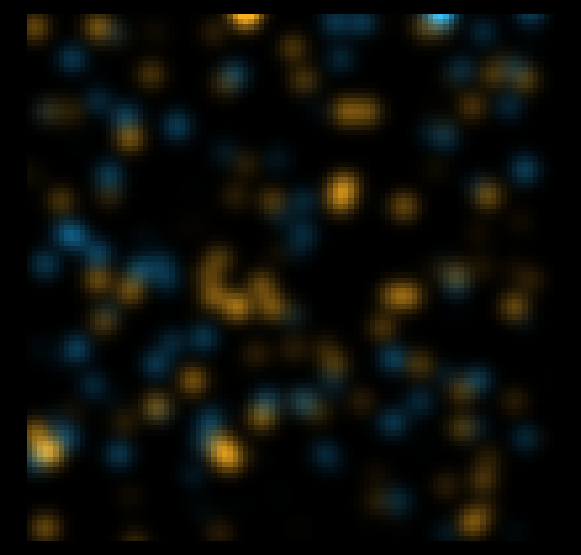
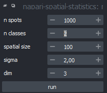
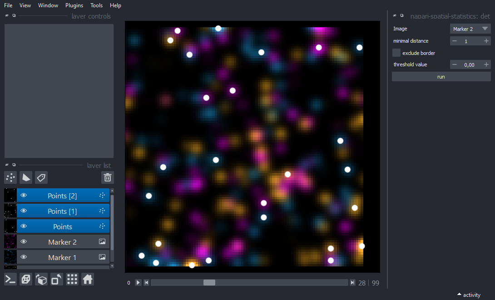
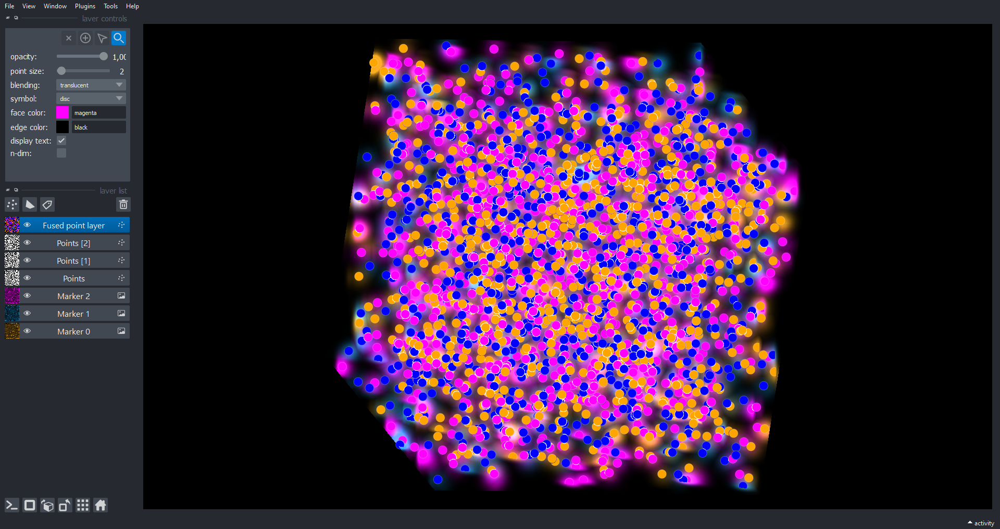
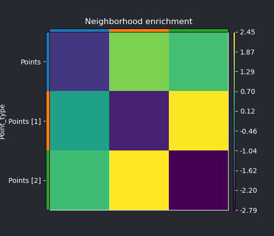

# Neighborhood enrichment test in image layer

This tutorial shows how to use napari-spatial-statistics to process image data with intensity maxima that denote the presence of spatially distributed objects. This plugin helps you to detect such spots and analyze them regarding over-prepresentation or depletion of objects of a specific kind in the neighborhood of others.

### Data generation

First, we use the built-in random data generator from napari-spatial-statistics to create a set number of image layers with bright spots of differen size:

 

The settings of the data generator refer to the following properties:
- `n_spots`: Number of spots to be created
- `n_classes`: Number of object classes: Each "class" could, for instance, refer to a different cell type in a real experiment and is stored in a separate image layer (which could, for instance, refer to separate channels in image data).
- `sigma`: The spots will be blurred in 3D - this variable determines how much.
- `dim`: Select whether data should be 2D/3D/4D.

The result (in 2D) will look like this:

### Peak detection
Napari-spatial statistics provides a basic maxima detection as provided by [scikit-image ](https://scikit-image.org/docs/stable/api/skimage.feature.html#skimage.feature.peak_local_max). To use it, select it from `Plugins > napari-spatial-statistics > detect maxima` and use it **on each of the generated image layers**. This will create three separate points layers with each layer containing point data from one image layer:

Since napari-spatial-statistics operates on data stored in single point layers, you need to merge the separate points layers into a single layer. To do this, use `Plugins > napari-spatial-statistics > merge points layers` and lick `Run`. This will collect all present points layers and merge them into a single layer: 

You can now proceed with the analysis as described in [this tutorial](./demo_nhe_points_layer.md). Running the test described there generates a neighborhood enrichment matrix that denotes the enrichment score between all types of object:

